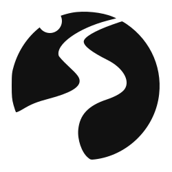

[![Contributors][contributors-shield]][contributors-url]
[![Forks][forks-shield]][forks-url]
[![Stargazers][stars-shield]][stars-url]
[![Issues][issues-shield]][issues-url]
[![MIT License][license-shield]][license-url]

<br />
<div align="center">
<picture>
<source srcset="public/logo-transparent-dark.svg" media="(prefers-color-scheme: dark)">

</picture>

<h3 align="center">Neopathways</h3>
<p align="center">Advanced Open-Source security solutions and Identity services.</p>

  <p align="center">
    <a href="https://github.com/neopathways/neopathways.de/issues">Report Bug</a>
    ·
    <a href="https://github.com/neopathways/neopathways.de/issues">Request Feature</a>
  </p>
</div>

- [About](#about)
	- [API](#api)
- [Contributing to Neopathways](#contributing-to-neopathways)
	- [How to Contribute](#how-to-contribute)
	- [Contribution Guidelines](#contribution-guidelines)
	- [Where to Start](#where-to-start)
- [License](#license)

## About

Neopathways is a technology company dedicated to creating open-source solutions across a wide range of projects. We specialize in developing advanced systems, including surveillance tools and identity management platforms, that empower organizations to operate more efficiently and securely.

### API

Our API provides robust and flexible access to the core functionalities of Neopathways' suite of technologies. Designed with developers in mind, it allows seamless integration with your existing systems, enabling you to leverage our advanced tools and features directly within your applications.

Key Features:

- **Comprehensive Data Access:** Retrieve, update, and manage data across various projects, from surveillance systems to identity management, using our API endpoints.
- **Secure and Scalable:** Built with security at the forefront, our API ensures your data remains protected while supporting high-volume requests and large-scale operations.
- **Open-Source Flexibility:** As part of our commitment to open-source, the API is fully customizable, allowing you to tailor its functionality to meet the specific needs of your projects.
- **Extensive Documentation:** Our API is thoroughly documented, with clear examples and guides to help you get started quickly and make the most of its capabilities.

Whether you're looking to integrate our surveillance tools, manage identity data, or build entirely new applications, the Neopathways API offers the power and flexibility you need to succeed.

## Contributing to Neopathways

At Neopathways, we believe in the power of community and open collaboration. We welcome contributions from developers, designers, and enthusiasts who are passionate about technology and want to help us build innovative solutions. Whether you're looking to add new features, fix bugs, or improve documentation, your contributions are valuable and help drive the success of our projects.

### How to Contribute

**1. Fork the Repository**

- Start by forking the Neopathways repository on GitHub to your own account. This will allow you to make changes without affecting the main project.

**2. Set Up Your Development Environment**

- Clone the forked repository to your local machine:

  ```bash
  git clone https://github.com/your-username/neopathways.git
  cd neopathways
  ```

- Follow the setup instructions in the `README` to install dependencies and get the project running locally.

**3. Make Your Changes**

- Create a new branch for your feature or bug fix:

  ```bash
  git checkout -b feature/new-feature
  ```

- Make your changes in the codebase. Be sure to follow the project's coding standards and best practices.

**4. Write Tests**

- If applicable, write tests to cover your changes. We use a variety of testing frameworks depending on the project, so check the documentation for guidance.

**5. Submit a Pull Request**

- Push your changes to your forked repository:

  ```bash
  git push origin feature/new-feature
  ```

- Go to the original Neopathways repository on GitHub and open a pull request (PR) from your branch. Provide a clear and concise description of your changes, including any relevant issue numbers.

**6. Participate in Code Review**

- A member of the Neopathways team will review your pull request. Be open to feedback and be prepared to make revisions if needed.

**7. Celebrate Your Contribution**

- Once your pull request is merged, you’ve officially contributed to Neopathways! Your contribution will be recognized, and you'll be listed among our contributors.

### Contribution Guidelines

- **Code of Conduct:** We expect all contributors to adhere to our [Code of Conduct](#), fostering a welcoming and respectful environment.
- **Issue Tracking:** Before starting work, check the issue tracker to see if your contribution is already being worked on or has been requested by others.
- **Commit Messages:** Write clear, descriptive commit messages. We use conventional commit formats to maintain a consistent history.
- **Documentation:** Ensure that any new features or changes are well-documented. This helps other users and contributors understand how to use the new functionality.

### Where to Start

- **Good First Issues:** If you're new to contributing, check out the [Good First Issues](#) label in our issue tracker. These are typically smaller, well-defined tasks that are ideal for new contributors.
- **Feature Requests:** If you have an idea for a new feature, open a discussion or create a feature request in our issue tracker.

Thank you for considering contributing to Neopathways. Together, we can continue to create innovative, open-source solutions that make a real impact. If you have any questions or need help getting started, don’t hesitate to reach out to our community or core team.

## License

Distributed under the MIT License. See `LICENSE` for more information.

[contributors-shield]: https://img.shields.io/github/contributors/neopathways/neopathways.de.svg?style=for-the-badge
[contributors-url]: https://github.com/neopathways/neopathways.de/graphs/contributors
[forks-shield]: https://img.shields.io/github/forks/neopathways/neopathways.de.svg?style=for-the-badge
[forks-url]: https://github.com/neopathways/neopathways.de/network/members
[stars-shield]: https://img.shields.io/github/stars/neopathways/neopathways.de.svg?style=for-the-badge
[stars-url]: https://github.com/neopathways/neopathways.de/stargazers
[issues-shield]: https://img.shields.io/github/issues/neopathways/neopathways.de.svg?style=for-the-badge
[issues-url]: https://github.com/neopathways/neopathways.de/issues
[license-shield]: https://img.shields.io/github/license/neopathways/neopathways.de.svg?style=for-the-badge
[license-url]: https://github.com/neopathways/neopathways.de/blob/master/LICENSE.txt
